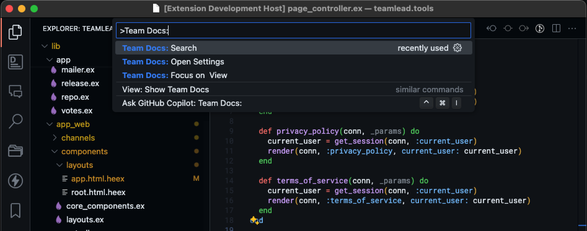
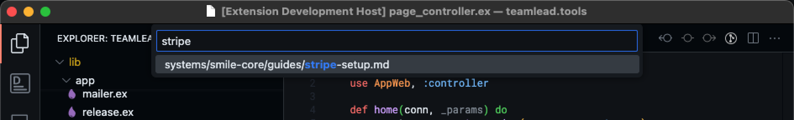
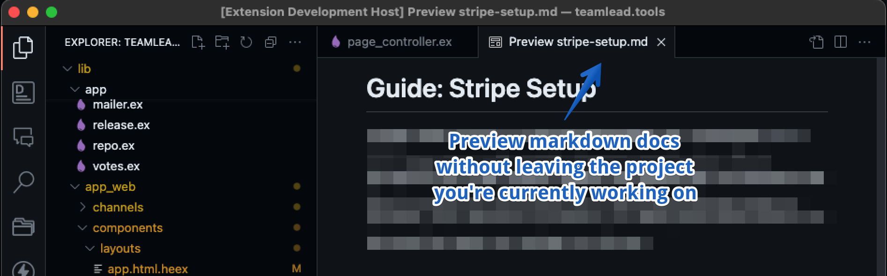
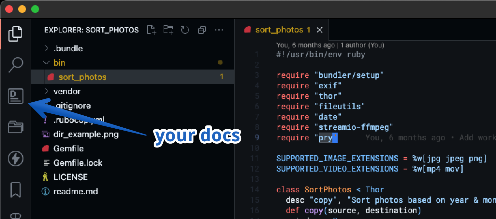
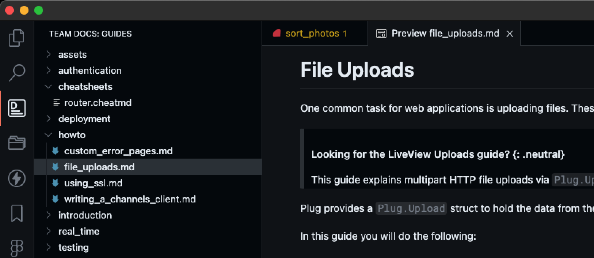

# TeamDocs by lucasprag.com

[TeamDocs](https://marketplace.visualstudio.com/items?itemName=lucasprag.teamdocs&ssr=false#overview) ensures that your centralized documentation is conveniently accessible from the Activity Bar, regardless of the specific project you are currently working on.

## Features

### Team Docs Search

While working on your project, search for your team's documentation written in Markdown, eliminating the need to navigate away from your project.

1. Run the command `Team Docs: Search`

2. Type to find your file

3. Hit Enter or Return to preview the markdown document.

### Team Docs Explorer

While working on your project, access and review the team's documentation written in Markdown from the Activity Bar, eliminating the need to navigate away from your project.

Click on Team Docs in the Activity Bar to see your team's documentation.

## Extension Settings

This extension contributes the following settings:

* `teamdocs.path_to_docs_folder`: Set the path to your documentation folder. Ex: ``~/Docs/engineering``.

**Thank you**